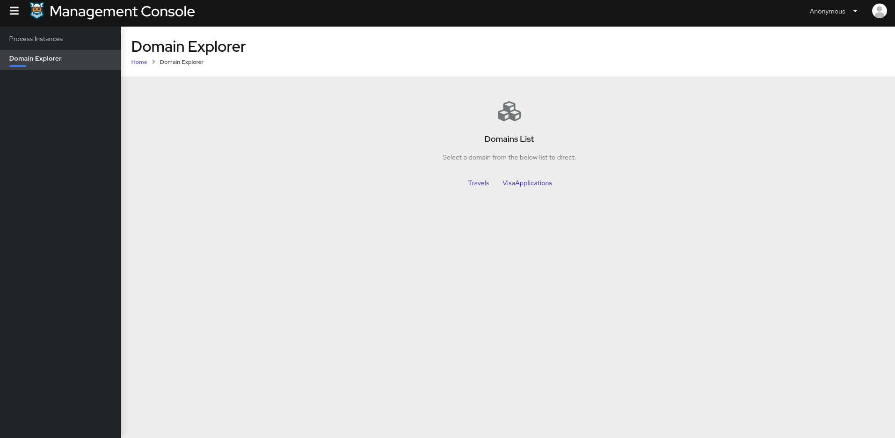

# management-console project

This project uses Quarkus, the Supersonic Subatomic Java Framework.

If you want to learn more about Quarkus, please visit its website: https://quarkus.io/ .

## Running the application in dev mode

You can run your application in dev mode that enables live coding using:
```
mvn quarkus:dev
```
Note: Live coding of the React JS frontend application is not yet in place.

## Packaging and running the application

The application is packageable using:
```
mvn package
```
It produces the executable `management-console-8.0.0-SNAPSHOT-runner.jar` file in `/target` directory.
Be aware that it’s not an _über-jar_ as the dependencies are copied into the `target/lib` directory.

The application is now runnable using:
```
java -jar target/management-console-8.0.0-SNAPSHOT-runner.jar
```

## Creating a native executable

You can create a native executable using: 
```
mvn package -Dnative
```

Or you can use Docker to build the native executable using:
```
mvn package -Dnative -Dquarkus.native.container-build=true
```

You can then execute your binary: `./target/management-console-8.0.0-SNAPSHOT-runner`

If you want to learn more about building native executables, please consult https://quarkus.io/guides/building-native-image-guide .

## Packaging together with the React app

The application makes use of a separately developed [React UI application](../packages/management-console/package.json). The JS based frontend can be built as part of the build of this project by using the `ui` profile, invoked using
```
mvn package -Dui
```

To prepare all the dependencies needed for the build of UI, there's a maven profile activated by `ui.deps` property being specified that user need to run before the actual build.

The single command to activate both profiles is:
```
mvn package -Dui.deps -Dui
```

## Creating a native executable
The native build of the application bundling in the React JS frontend does not differ from the instructions above. The only thing that's new is again the invocation of UI specific profiles.
```
mvn package -Dui -Dnative
```


## Domain Explorer

Domain Explorer allows you to inspect domain related data and process instances based on domains that are available.

You can navigate to Domain Explorer by clicking "**Domain Explorer**" tab available on the sidebar, which will take you landing page of
domain explorer and there you can see a list of available Domains.



Selecting a domain on the landing page will direct you to a dashboard, where you can view all domain related data and list of processes associated with it.


### Column Picker

Domain Explorer allows you to select the domain attributes that you wish to see on the result table.

This column picker is a multi select dropdown that contains the available domain attributes, that allows you to select any number of options available in the dropdown, there are few options that are selected by default which can be changed of your choice. The options available in the dropdown follows a certain nested pattern, displayed the entire graph of attributes available in the specific domain.

eg: "**hotel/address**" denotes address attribute of hotel.

After selecting/deselecting options from the dropdown, clicking on "**Apply columns**" would get you domain data on the table.


### Refresh option

There can be a possibilites of,
* change in state of processes, while performing operations like skip, retry or abort
* New process instance being added.

In order to check the current state of processes or current list of processes available on the domain you can always do a refresh of the table by clicking icon placed next to Apply columns button. This will get you current and updated content to the table.


### Dashboard

The table on the Domain Explorer will provide you information about the specific domain data and list of processes associated with it.

To check the list of processes, you may have to expand each row of the table by clicking on the **carret** icon available on each row.


### Navigate to process details

To get to know more about a process, you can always click on any process instance to direct to process details page and there you can see details about the process as well as the timeline and process variables.

